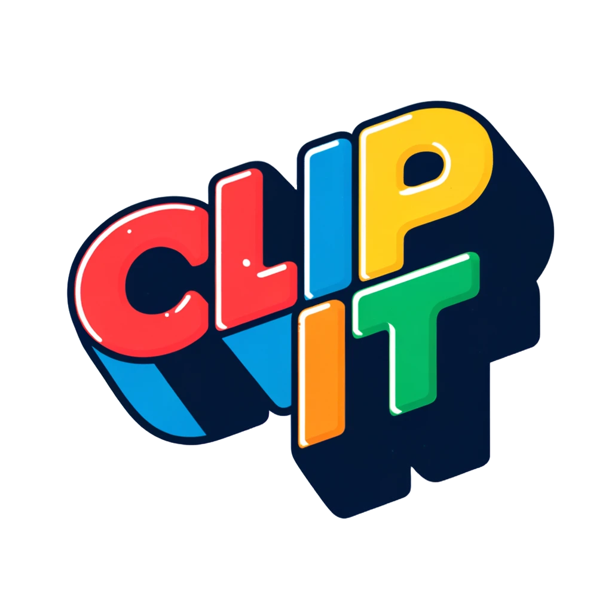

<!-- Improved compatibility of back to top link -->
<a id="readme-top"></a>

<!-- PROJECT SHIELDS -->
[![Contributors][contributors-shield]][contributors-url]
[![Forks][forks-shield]][forks-url]
[![Stargazers][stars-shield]][stars-url]
[![Issues][issues-shield]][issues-url]

<!-- PROJECT LOGO -->
<br />
<div align="center">
  <a href="https://github.com/Ahmedh27/Clipit">
    
  </a>

  <h3 align="center">ClipIt: A Minimalist Short-Form Video Sharing Platform</h3>

  <p align="center">
    A distraction-free platform for creating and sharing short-form videos.
    <br />
    <a href="https://github.com/Ahmedh27/Clipit"><strong>Explore the docs »</strong></a>
    <br />
    <br />
    <a href="https://github.com/Ahmedh27/Clipit">View Demo</a>
    ·
    <a href="https://github.com/Ahmedh27/Clipit/issues/new?labels=bug&template=bug-report---.md">Report Bug</a>
    ·
    <a href="https://github.com/Ahmedh27/Clipit/issues/new?labels=enhancement&template=feature-request---.md">Request Feature</a>
  </p>
</div>

<!-- TABLE OF CONTENTS -->
<details>
  <summary>Table of Contents</summary>
  <ol>
    <li>
      <a href="#about-the-project">About The Project</a>
      <ul>
        <li><a href="#built-with">Built With</a></li>
      </ul>
    </li>
    <li>
      <a href="#getting-started">Getting Started</a>
      <ul>
        <li><a href="#prerequisites">Prerequisites</a></li>
        <li><a href="#installation">Installation</a></li>
      </ul>
    </li>
    <li><a href="#usage">Usage</a></li>
    <li><a href="#roadmap">Roadmap</a></li>
    <li><a href="#team">Team</a></li>
    <li><a href="#acknowledgments">Acknowledgments</a></li>
  </ol>
</details>

<!-- ABOUT THE PROJECT -->
## About The Project

ClipIt is a minimalist short-form video sharing platform designed to provide a distraction-free experience for users. Unlike feature-heavy competitors, ClipIt focuses on simplicity, allowing users to create, share, and interact with short videos without unnecessary clutter.

<p align="right">(<a href="#readme-top">back to top</a>)</p>

### Built With


* **Frontend:** Next.js 13, React, Tailwind CSS
* **State Management:** Zustand
* **Backend & Storage:** AppWrite
* **Deployment:** Vercel
* **Authentication:** GitHub OAuth API

<p align="right">(<a href="#readme-top">back to top</a>)</p>

<!-- GETTING STARTED -->
## Getting Started

Follow these instructions to set up the project locally.

### Prerequisites

* npm
  ```sh
  npm install npm@latest -g
  ```
* Node.js (Download from Node.js Official Website)
* PostgreSQL (Follow PostgreSQL Installation Guide)
* Docker (optional for deployment)

### Installation

1. Clone the repo
   ```sh
   git clone https://github.com/Ahmedh27/Clipit.git
   ```
2. Navigate into the project directory
   ```sh
   cd Clipit
   ```
3. Install dependencies
   ```sh
   npm install
   ```
4. Set up your environment variables in a `.env` file:
   - Database credentials
   - Cloudinary API keys
   - Other configurations

5. Start the development server
   ```sh
   npm start
   ```

6. (Optional) Build and run with Docker
   ```sh
   docker-compose up --build
   ```

<p align="right">(<a href="#readme-top">back to top</a>)</p>

<!-- USAGE -->
## Usage

ClipIt allows users to:

* Create short-form videos (up to 30 seconds)
* Apply basic filters or effects to videos
* Like, comment, and share videos
* Discover content using a search feature based on tags, creators, or trends

For more details, refer to the Documentation.

<p align="right">(<a href="#readme-top">back to top</a>)</p>


<!-- TEAM -->
## Team

* [Ahmedh27](https://github.com/Ahmedh27)
* [Kenneth882](https://github.com/Kenneth882)
* [Andyig20](https://github.com/Andyig20)

<p align="right">(<a href="#readme-top">back to top</a>)</p>

<!-- ACKNOWLEDGMENTS -->
## Acknowledgments

* Special thanks to our professor for their guidance and support throughout the development of ClipIt.

<p align="right">(<a href="#readme-top">back to top</a>)</p>

<!-- MARKDOWN LINKS & IMAGES -->
[contributors-shield]: https://img.shields.io/github/contributors/Ahmedh27/Clipit.svg?style=for-the-badge
[contributors-url]: https://github.com/Ahmedh27/Clipit/graphs/contributors
[forks-shield]: https://img.shields.io/github/forks/Ahmedh27/Clipit.svg?style=for-the-badge
[forks-url]: https://github.com/Ahmedh27/Clipit/network/members
[stars-shield]: https://img.shields.io/github/stars/Ahmedh27/Clipit.svg?style=for-the-badge
[stars-url]: https://github.com/Ahmedh27/Clipit/stargazers
[issues-shield]: https://img.shields.io/github/issues/Ahmedh27/Clipit.svg?style=for-the-badge
[issues-url]: https://github.com/Ahmedh27/Clipit/issues
